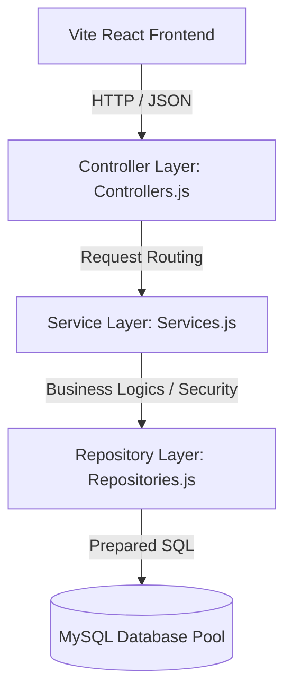

# Nestly Enterprise Platform - Core CS Concepts Guide

This study guide explains how core Computer Science subjects—Object-Oriented Programming (OOP), System Design, Database Management Systems (DBMS), and Network Security—are implemented within the Nestly Real Estate project. Use this reference to study and answer questions such as *"How have you used OOP/Security in this project?"*.

---

## 1. Object-Oriented Programming (OOP)

We have utilized ES6 Classes on both the backend and frontend to structure our application logic, encapsulating behaviors and leveraging inheritance to minimize redundancy.

### A. Encapsulation
Encapsulation wraps data (attributes) and behavior (methods) into a single unit (class) while restricting direct access to some of the object's components.
*   **Backend Services:** [AuthService](file:///c:/Users/Aditya%20Jadhav/Desktop/Projects/Real%20Estate%20-%20Original/real-estate-listings/server/services.js) encapsulates cryptography tasks like Bcrypt password hashing, JWT generation, and temporal student OTP validations. Clients can verify credentials without knowing the underlying encryption algorithms.
*   **Frontend Models:** [PropertyListing](file:///c:/Users/Aditya%20Jadhav/Desktop/Projects/Real%20Estate%20-%20Original/real-estate-listings/src/models.js) encapsulates raw database rows. Rather than parsing unstructured JSON columns in multiple view components, getters like `listing.gallery` or `listing.amenities` clean up and format the output dynamically.

### B. Inheritance
Inheritance allows one class to inherit attributes and methods from another, promoting code reusability.
*   **Backend Repositories:** [Repository](file:///c:/Users/Aditya%20Jadhav/Desktop/Projects/Real%20Estate%20-%20Original/real-estate-listings/server/repositories.js) is a base class that encapsulates the database pool and provides a common `query()` executor. 
*   `UserRepository`, `ListingRepository`, and `BookmarkRepository` inherit from `Repository` (`class UserRepository extends Repository`). They gain access to database query methods without duplicating the pool connection handler.

### C. Abstraction
Abstraction hides implementation details and only exposes essential features to the caller.
*   **Client API Client:** [APIClient](file:///c:/Users/Aditya%20Jadhav/Desktop/Projects/Real%20Estate%20-%20Original/real-estate-listings/src/api.js) abstracts HTTP requests. UI components simply call `api.getListings()` or `api.login()`, hiding the complexities of request headers, JSON stringification, status code evaluations, and token inclusions.

---

## 2. System Design

Nestly implements a modular **3-Tier Controller-Service-Repository (CSR) Architecture**, separating concerns across discrete layers:



### Key System Design Patterns
1.  **Repository Pattern:** Separates database access queries from the controllers. If we decide to swap MySQL for PostgreSQL or MongoDB, only the Repository layer files need modification; the rest of the application remains unchanged.
2.  **Singleton Pattern:** The `api` client on the frontend is instantiated once and exported as a single object instance (`export default new APIClient()`). This maintains consistent access, unified base URLs, and shared authentication tokens.
3.  **Connection Pooling:** Instead of creating a database connection for every single HTTP request (which degrades performance), we instantiate a centralized database connection pool in [db.js](file:///c:/Users/Aditya%20Jadhav/Desktop/Projects/Real%20Estate%20-%20Original/real-estate-listings/server/db.js). Connections are checked out, reused, and returned automatically.

---

## 3. Database Management Systems (DBMS)

Our relational database design adheres to DBMS standards, guaranteeing data integrity and fast retrieval speeds.

### A. Database Transactions (ACID Properties)
We use transaction blocks to execute complex write routines atomically:
*   In `ListingRepository.deleteListingWithLog`, when a listing is deleted, we must log the deletion reason to the `listing_deletion_logs` table.
*   To ensure atomic execution (either both actions succeed or both rollback), we use:
    ```js
    const conn = await this.getTransactionConnection();
    try {
      await conn.beginTransaction();
      await conn.query(logSql, ...);
      await conn.query(deleteSql, ...);
      await conn.commit();
    } catch (err) {
      await conn.rollback();
    }
    ```

### B. Relational Integrity & Cascading Constraints
*   **Foreign Keys:** The `listings` table references `users(id)` via `seller_id`.
*   **Cascading Rules:** We configure `ON DELETE CASCADE` on `bookmarks` to auto-remove bookmarks if a listing is deleted. We configure `ON DELETE SET NULL` on `listings` to retain listing data for metrics even if a landlord deletes their profile.

### C. Prepared Queries & Indexes
*   **SQL Injection Prevention:** Every query uses parameterized placeholder formats (`?`), which are compiled by the DBMS before parameters are inserted, preventing malicious SQL strings from altering query logic.
*   **Database Indexing:** We applied indexes to columns that are searched frequently (like `seller_id`, `listing_id`, `student_phone`), optimizing query lookups from `O(N)` scans to `O(log N)` tree searches.

---

## 4. Network Security

Security layers are implemented across authentication, network protocols, and rate-limiting.

### A. Network Security Middlewares (Helmet & CORS)
*   **Helmet:** [server/index.js](file:///c:/Users/Aditya%20Jadhav/Desktop/Projects/Real%20Estate%20-%20Original/real-estate-listings/server/index.js) uses the Helmet library to secure HTTP headers, protecting the app from Cross-Site Scripting (XSS), clickjacking, and MIME sniffing attacks.
*   **CORS:** Configured to restrict origin requests and allow only safe headers.

### B. Rate Limiting (DoS Mitigation)
*   We use `express-rate-limit` to establish request constraints:
    *   **Global Rate Limit:** Max 200 requests per 15 minutes.
    *   **Auth Rate Limit:** Stricter constraint of max 30 registration/login/OTP attempts per 15 minutes, mitigating brute-force credential stuffing.

### C. Cryptographic Hashing & JWT Authentication
*   **Bcrypt Password Hashing:** User passwords are never saved in plain text. We apply Bcrypt with 10 salt rounds (`bcrypt.hash(password, 10)`), protecting credentials from rainbow table lookup attacks.
*   **Stateless JSON Web Tokens:** Session tokens are signed using a secure `JWT_SECRET` key and returned to the client, authorizing requests statelessly without storing session tables in memory.
